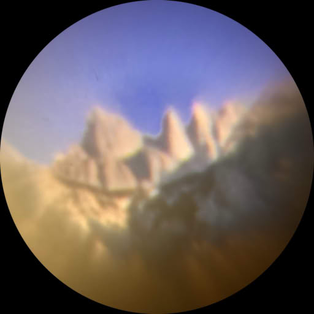
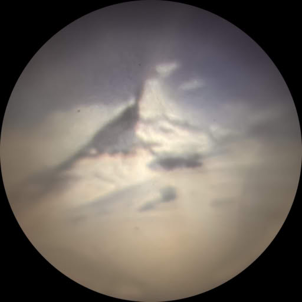
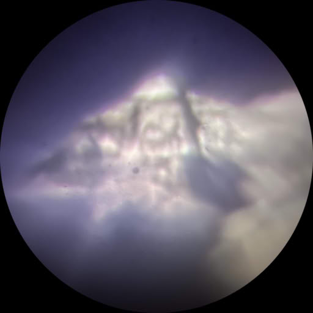
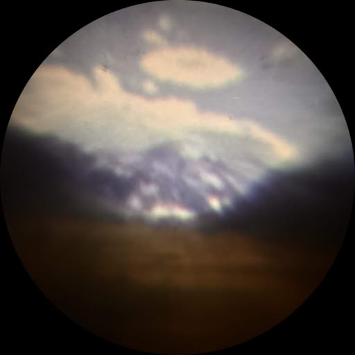
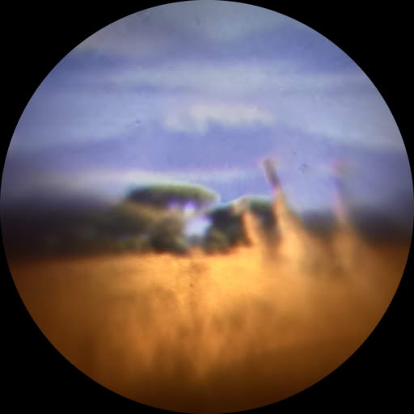

It is extremely hard to be speechless on a blog. There's a certain amount of _telling people what's going on_ needed. Let me try and get over my awe-struck amazement enough to tell you about the puzzle box my friends  and  **made** 🤯 and gave me at my recent 40th birthday party.

<figure>
  <svg viewBox="0 0 2048 1536" preserveAspectRatio="xMidYMid meet">
    <image alt="A circular brass puzzle box, roughly 10cm in diameter. It has what looks like the projection of lines of latitude and longitude on the front surface, and 5 glass covered holes through the middle, spread across an oscillating line of metal set into the middle." href="./the-puzzle.jpg" width="2048" height="1536"/>
    <a xlink:href="#bump-1"><circle cx="582" cy="443" r="46" fill="transparent"/></a>
    <a xlink:href="#bump-2"><circle cx="646" cy="834" r="52" fill="transparent"/></a>
    <a xlink:href="#matterhorn"><circle cx="1025" cy="457" r="48" fill="transparent"/></a>
    <a xlink:href="#kilimanjaro"><circle cx="1198" cy="705" r="48" fill="transparent"/></a>
    <a xlink:href="#everest"><circle cx="1388" cy="506" r="51" fill="transparent"/></a>
  </svg>
  <figcaption>
    This thing is <em>heavy</em> by the way. 859g of machined brass, 10cm in diameter and 1.4cm deep. I'm being precise in my measurements because <em>anything could be a clue! 🕵️‍♂️</em>
  </figcaption>
</figure>

I excitedly showed it to _so_ many people at that party, sharing my intrigue and joy, that I promised to blog through my attempts to open it — so here we go!

> [!IMPORTANT]
> I'm taking you on my journey as I solve my puzzle. _Please don't share ideas, suggestions, or spoilers with me_. I'm taking my time in enjoying this wonderful gift, don't take away my fun! ☺️

## The cryptex

I started with the lettering around the outside. I'd been told this puzzle box is tied to my own skills, so it's not surprising that I immediately recognised [toki pona](https://en.wikipedia.org/wiki/Toki_Pona), written in the joyful lettering called _sitelen pona_. This is a lovely "conlang" (constructed language) I started learning a few years ago.

I won't go down too much of a tangent, but this tiny language was constructed in 2001 by Sonja Lang to "simplify thought". It only has just over 100 words, so context is key and concepts get refined by others to slowly build up an idea of what's being described.



I _think_ the glyphs around the outside of my puzzle box make three sentences:

{}
sewipinenasulilitawaesitelenlonsinpin:: 
Nenapilinseloepanawasolajeloanpautalapimejajouta.. 
MΓunasaalealeolinwanselo..
{}

You can try and translate it yourself with an [online toki pona dictionary](https://nimi.li/) if you like! Here's what I made of the first sentence. (I'll translate the others here next time!)

| glyph                                       | word                               | meaning                              |
| ------------------------------------------- | ---------------------------------- | ------------------------------------ |
| sewi    | [sewi](https://nimi.li/sewi)       | up, top, highest, awesome, inspiring |
| pi      | [pi](https://nimi.li/pi)           | _modifier: refinements follow_       |
| nena    | [nena](https://nimi.li/nena)       | bump, hill                           |
| suli    | [suli](https://nimi.li/suli)       | big, tall, important                 |
| li      | [li](https://nimi.li/li)           | _modifier: verb follows_             |
| tawa    | [tawa](https://nimi.li/tawa)       | motion                               |
| e       | [e](https://nimi.li/e)             | _modifier: direct object follows_    |
| sitelen | [sitelen](https://nimi.li/sitelen) | image, picture, writing              |
| lon     | [lon](https://nimi.li/lon)         | located at                           |
| sinpin  | [sinpin](https://nimi.li/sinpin)   | vertical surface, wall               |

There are three modifiers in this sentence, defining relationships between the words around them:

- _[pi](https://nimi.li/pi)_ indicates that the "up" is also a "hill" and "tall" or "important". I think this describes the bumps on the surface of the puzzle! This is the sentence's subject.
- _[li](https://nimi.li/li)_ tells me that I should interpret the next word as a verb — so it's not _motion_, but to _make_ motion — or to move!
- _[e](https://nimi.li/e)_ points me at the object of the sentence, an image located at a wall.

So, being a little liberal, I translate this as:

> Move the bumps on the top to a wall to make an image.

I went to a dark room, and shone a bright light through these "important bumps" and…



Holy crap _images_. It's a tiny slide projector!

## The projector

There's only a few millimetres for each "slide" in these holes, so the photos are blurry at best, but here they are, on my wall, as I moved the light between them. (I've laid them out here in the same order as the photo of the puzzle box above, you can click on a bump up top, and it'll scroll to and highlight the relevant image here.)

  
  
  
  
  
  

These are mountains! These friends of mine know I love a good climb, but I don't think I've scaled any of these behemoths. They seem to be from all around the world — I immediately recognised [Kilimanjaro](#kilimanjaro) with the giraffes, but what about the other ones?

It's interesting that the bump showing Kilimanjaro (roughly 3.1ºS, 37.4ºE) is just below the "equator" on the brass surface, and just over two vertical lines right… or _East_ of the middle. That'd make each of the divisions on the brass front about 15º (vertically as well, as that'd put the poles at ±90º).

I initially thought the first one showed the [Torres del Paine](https://en.wikipedia.org/wiki/Torres_del_Paine_National_Park) (which I am [predisposed to spotting everywhere](/posts/adventure-awaits/a-patagonian-love-story) 😜), but the shape isn't _quite_ right, and these brass lines put this image North of the equator, not in Patagonia.

So here are my guesses at positions for each of the bumps, using their position on the puzzle box, and looking for tall mountains in the area that look similar!

| #   | Location       | My best guess                                                              |
| --- | -------------- | -------------------------------------------------------------------------- |
| 1   | 30ºN, 112ºW ?  | ~~[Picacho del Diablo](https://en.wikipedia.org/wiki/Picacho_del_Diablo)~~ |
| 2   | 26ºS, 68ºW ?   | [Nevado Tres Cruces](https://en.wikipedia.org/wiki/Nevado_Tres_Cruces)?    |
| 3   | 45.5ºN, 7.5ºE  | [Matterhorn](https://en.wikipedia.org/wiki/Matterhorn)                     |
| 4   | 3.1ºS, 37.4ºE  | [Kilimanjaro](https://en.wikipedia.org/wiki/Mount_Kilimanjaro)             |
| 5   | 27.6ºN, 86.6ºE | [Everest](https://en.wikipedia.org/wiki/Mount_Everest)                     |

The first two of these I'm much less certain of; Picacho del Diablo doesn't have anything like the same silhouette as what I'm seeing in the projection (but it's very close position wise, with nothing of the same shape I can find nearby). Nevado Tres Cruces doesn't _quite_ look the same either. I'm going to have to do some more exploring!

## The adventure continues!

And that that's where I think I'll leave this puzzle update! You can follow along with the [Puzzle Box series](/series/puzzle-box/) series, [my blog, or my socials](/) if you'd like to see what I figure out next!
