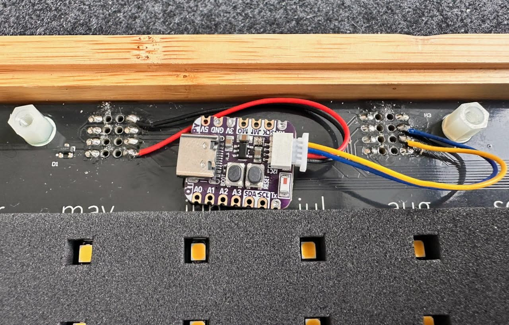

> You can skip ahead to [making your own](#get-making), if you like!

A long while ago I splashed out on an [Every Day Calendar](https://yetch.studio/products/every-day-goal-calendar). I loved the idea of taking pride in routine, I adored its beautiful & simple _physical_ interface for that, and [Simone Giertz's videos](https://www.youtube.com/watch?v=sMDMAc8msVk) sparked joy every time I saw them, so backing her [kickstarter](https://www.kickstarter.com/projects/simonegiertz/the-every-day-calendar) was a hard choice _not_ to make.

My one reservation though, was that it missed an online component — I wanted it to be truly _every_ day, not just the ones when I was at home. But I like hardware hacking, and knew Simone was [releasing all the code](https://gitlab.com/simonegiertz/the-every-day-calendar) for the calendar (😍), so figured I'd be able to make that happen _somehow_. The spark of inspiration didn't come though, and I happily enjoyed the physical calendar on the wall in my office.

…until this January, when I discovered the lovely [goals.garden](https://goals.garden/) site — [Sri](https://bluesky.app/profile/did:plc:7gm5ejhut7kia2kzglqfew5b) had clearly been inspired by Simone's Every Day Calendar too! This was perfect for me; it [launched](https://sri.leaflet.pub/3mbg43rkass2y) right on the new year, while I was abroad travelling with my Dad, so it meant I could start my new years' intentions without my physical calendar _and_ it was built on top of my favourite technology of the moment: [ATProto](https://atproto.com) (the tech behind [Bluesky](https://bsky.app)).

This weekend, _gloriously_ timed with Sri's fresh improvements to [goals.garden](https://goals.garden), I finally put together all the pieces I needed to internet-enable my Every Day Calendar! It ended up being simple enough that [I bet you could do it too](#get-making).

## Building on ATProto

Building in the ATProto ecosystem is _fun_. You entirely own your own data, so there are no developer accounts with large companies to register for, or API limits or restrictions on what you can do. Sri built the [goals.garden](https://goals.garden) site on ATProto, so it stores [little data records](https://pdsls.dev/at://did:plc:ephkzpinhaqcabtkugtbzrwu/garden.goals.completion/3meq4efcirstr) on the account _I own_ to track my daily completions. I can edit those records directly, delete them, add to them however I like, and goals.garden displays what it finds — **instant interoperability**.

In fact this flexibility was the spark that meant this could happen at all: I needed the data in a specific format to suit the excellent [microcosm APIs](https://www.microcosm.blue/) and the _tiny_ processor I added to my calendar… so I just edited my own records to include the [AT URI](https://atproto.com/specs/at-uri-scheme) I needed. I didn’t need permission from anyone else to do that, or to take time on coordinating when I wanted to experiment. When it worked, I reached out to Sri to find out if he'd be kind enough to add these same attributes to his app. He was! (Thank you Sri!)

## Get making

This is the entirety of the physical changes I made to my calendar. You’ll need a soldering iron, a pair of wire-strippers, an [Adafruit QT Py ESP32-S3](https://thepihut.com/products/adafruit-qt-py-esp32-s3-wifi-dev-board) (£12) and _half_ a [Qwiic/Stemma QT cable](https://thepihut.com/products/stemma-qt-qwiic-jst-sh-4-pin-cable-100mm-long) (£1).

You can follow the [codebase’s guide](https://tangled.org/byjp.me/every-day-calendar) to solder things up, flash the firmware, and get your calendar sync’d up.

Do [let me know](https://bsky.app/profile/byjp.me) how you get on! I’ve a busy life at the moment (more on that soon), but I’ll do my best to help you if you’re having trouble.

Huge thanks to [Simone](https://www.simonegiertz.com/) for the hardware, [Sri](https://bsky.app/profile/sr.xyz) for the website, [Momin](https://bsky.app/profile/fool.dev) for fun firmware improvements, [Microcosm](https://www.microcosm.blue/) for their excellent APIs, the [ATProto](https://atproto.com) team, and the thousands of engineers who built the hundreds of open source libraries this is built upon. 