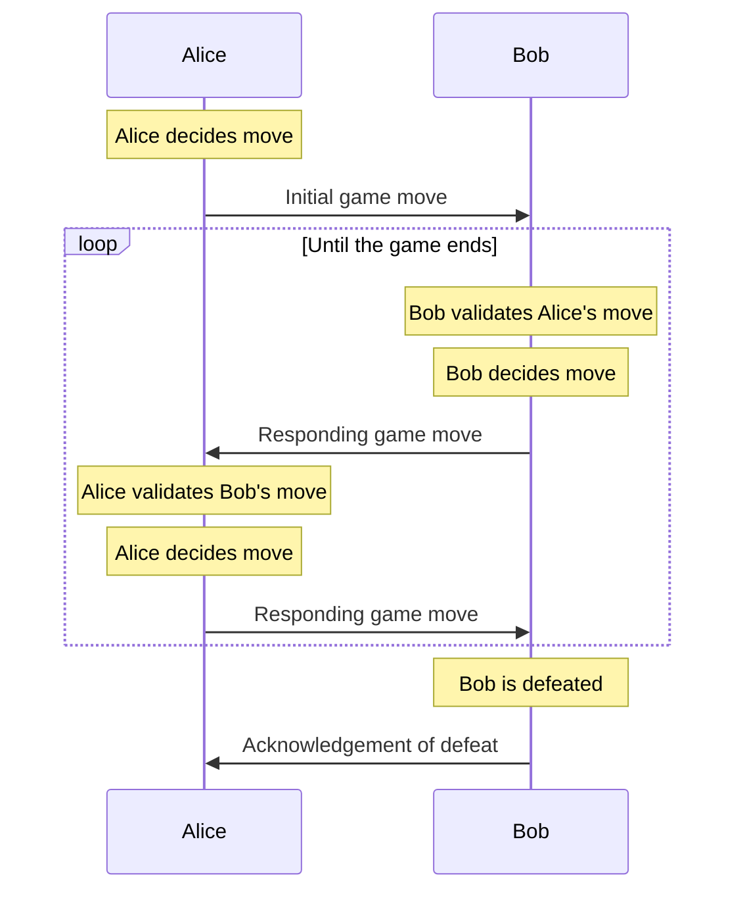

Yesterday I wrote a behemoth of a blog post about why I'm excited about distributed protocols, with not-really-that-short descriptions of 4 different projects that are gently ticking over in my head. It was a mess 😂

I've decided to split it apart into a mini-series on distributed game protocols (and probably another post on my favourite distributed microblogging protocol, ATProto, and why I think it's so interesting).

This is the first in the distributed game protocols series, covering what they are and why they're useful, and the simplest form I've been thinking about: open games, like Chess and Go.

This post series:

- [Open games](./) (this post)
- [Games with randomness](../randomness/)
- Games with fate and secrets (Coming soon!)

## What and why?

To collaborate on anything we need _some_ level of agreed methodology for accomplishing our desired outcome — a _protocol_. When you're playing a game with someone — [Yaniv](https://en.wikipedia.org/wiki/Yaniv_(card_game)), [Chess](https://en.wikipedia.org/wiki/Chess), [Scrabble](https://en.wikipedia.org/wiki/Scrabble), or perhaps even [Pandemic](https://en.wikipedia.org/wiki/Pandemic_(board_game)) — the game's protocols (the rules) usually fall into 5 categories:

- **you** and **your opponent(s)**: the players/agents in the game, independent and often identical in terms of role, those who make decisions.
- **random chance**: the dice you roll, to bring a little chaos to the game.
- **fate**: the deck of cards you shuffled at the start, which you only see as you draw.
- **the board**: the 'state' of the game, a record of the outcomes of the decisions, randomness, and fated changes up to this point.
- **secrets**: the cards or tiles in your hand that your opponent can't see.

When you're in the real world these things are all very simple to bring about — you and your friend(s) are sitting together, the dice are fair, you can see cheating peeks at the cards, there is only one shared board, and you can (mostly) keep your cards secret from your neighbour.

What happens when you want to play a game like this when you're not in the same place? We have the internet — messaging apps, email and everything else — so communicating our decisions is easy enough, but after this things get tricky.

You _claim_ you rolled a six with your fair dice; how can I know you didn't cheat? You claim you didn't know the next card in the deck was going to be in your favour, but how do I know you didn't peek? We both _think_ we've kept track of the board in the same way, but what happens if one of us made a mistake, and we're actually playing two different games? How do I draw a card from the deck and keep it secret from you, while also being able to prove I did draw that one?

_These_ are the problems that distributed game protocols address, and I'll cover the simplest of these in this blog post: the players and the board.

## Open games

I call the set of games that has no chance, fate, or secrecy "open" because literally all parts of it are open and visible at all times. The difficulty of the game is in the breadth of possible choices by the players, and the (un)predictability of the effect those choices have.

Games like [Chess](https://en.wikipedia.org/wiki/Chess) and [Go](https://en.wikipedia.org/wiki/Go_(game)) are great examples here, and playing them with a distributed protocol is far older than the internet. Game geeks have a [long history](https://en.wikipedia.org/wiki/History_of_chess) of playing chess remotely, using a [standard notation](https://en.wikipedia.org/wiki/Chess_notation) of some kind to communicate moves to each other — [correspondence chess](https://en.wikipedia.org/wiki/Correspondence_chess), as it's still called.

Below is a sequence diagram I've put together to show how simple a game of remote chess can be played. It's so simple it feels a little strange to spend time documenting and diagramming it!



The only place a protocol like this can sometimes go wrong is if there is an error in one of the messages sent between players, a piece accidentally moved to the wrong square, or an over enthusiastic cat near the chessboard.

In the case of _noticeable_ incorrectness (bad kitty, you knocked the pieces off the board!) a player can request a description of the board from the other. But how might we detect a subtle error?

### Consistent hashing algorithms

Naturally, a very simple way of detecting errors here would be to scribble down the full layout of the new chessboard on the postcard containing your move as you make your correspondence chess play; but for more complex games, or where the amount of space you have for transmitting your move is small, we'd need something more sophisticated.

In computing, [error detection and correction codes](https://en.wikipedia.org/wiki/Error_detection_and_correction) are used _literally everywhere_ to be able to detect (and optionally correct) exactly these kinds of otherwise invisible errors. In modern digital systems the components that store the 1s and 0s at the foundation of your machine are so small that an errant particle from the sun can (and does!) flip a zero to a one, or vice versa, at any moment — error correction codes are how we get around this.

A distributed game protocol can use similar techniques to protect your game from subtle errors too. The one method I want to introduce before the next post is [hashing algorithms](https://en.wikipedia.org/wiki/Hash_function). These are processes for turning an arbitrarily large amount of data into a small(ish) number that changes a lot, even when the data changes only a little.

You probably have a perfect example of this close at hand: your credit card number. The last digit of that long number on your card _isn't a part of your card number_, it's a "check digit". If you type one of your digits incorrectly, the check digit will be off, and a computer can know to ask you to check your typing.

They use the [Luhn algorithm](https://en.wikipedia.org/wiki/Luhn_algorithm), and you can check your credit card number is correct right now:

1. Write your credit card number out on a piece of paper, with some space between each digit (a piece you can destroy afterwards!)
2. Double every other digit
3. Anywhere that became a double-digit number, add the two digits together
4. Sum all the numbers
5. If the final number is divisible by 10 (ie. ends in a zero) then the card number is valid.

Here's a worked example with short (not a) credit card number: 4417 8259

```plain The Luhn algorithm
Step 1:   4   4   1   7   8   2   5   9
Step 2:   8   4   2   7   16  2   10  9
Step 3:   8   4   2   7   7   2   1   9
Step 4:   8   12  14  21  28  30  31  40

40 ends in a zero; the card is valid!
```

You can try out what happens if there's an error; if you put a 6 instead of that 7, then 21 becomes 22, and 40 becomes 41 (not a valid card!)

Credit card manufacturers take their _actual_ credit card number (one digit too short) and follow the same process above, with one final twist to calculate the last digit.

Put an `X` for the last digit of your card (removing the last column of working), and find the new sum in Step 4 — in my example that would be `31`. I note that `40` is the next divisible-by-ten number above `31`, and calculate `40 - 31 = 9`. This means `9` must be the last digit of my fake-card for it to be valid.

This is a (very simple) consistent hashing algorithm — a way to consistently turn larger data into a smaller number which represents that data. We'll need more of them as we look at [Games with Randomness](../randomness/) in the next post!
