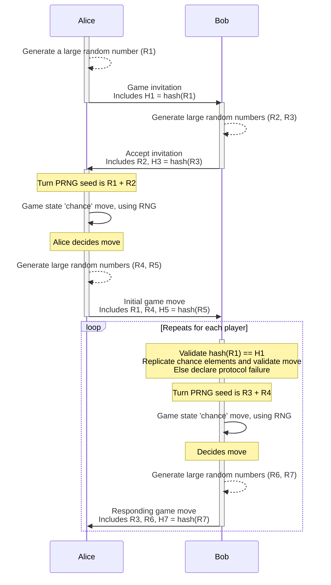

Last week I wrote about what a distributed game protocol is, and why they're useful: for playing games (cards, board games, etc.) with someone who isn't physically present with you. I covered "[open games](../open-games/)", those which only need the players and the board (like Chess), and omit randomness, fate, and secrecy. If you haven't read that post, you should! It covers some context you'll need for this one.

Keep reading if you're interested in how we can design a protocol that allows us to play a game remotely where you can trust that your opponent isn't cheating with their dice rolls!

This post series:

- [Open games](../open-games/)
- [Games with randomness](../randomness/) (this post)
- Games with fate and secrets (Coming soon!)

## Trusting randomness

It may seem obvious, but let's take a moment to understand why we might need randomness in games, and where the problem comes from when we're trying to use it remotely.

Perhaps you're familiar with [Snakes and Ladders](https://en.wikipedia.org/wiki/Snakes_and_ladders), [Sorry](https://en.wikipedia.org/wiki/Sorry!_(game)), or the arch-nemesis of games, [Monopoly](https://en.wikipedia.org/wiki/Monopoly_(game)). These meet all the requirements of an "[open game](../open-games/)", but _also_ use one or more dice — the most common way to introduce randomness to a boardgame. Throw an evenly weighted cube around and you get a random 1-6 number to help introduce a little chaos to your game.

If we tried taking the playing-locally approach to a remote game, you'd quickly run into trust problems. If I tell you I rolled a six, and just _happened_ to land on this ladder (and not that slippery snake), you might wonder how I get so lucky all the time. We could play with webcams turned on and roll our dice on-screen, but with AI going the way it is, it won't be long until someone could fake a dice throw on video in real time. We could include a friend in our game, as our official dice-roller —someone who we trust to not bias their rolls to either one of us — but they'd probably get bored very quickly and leave us stuck.

We _have_ good [random number generators](https://en.wikipedia.org/wiki/Random_number_generation) on computers but, whether they're [pseudo- or true-random](https://en.wikipedia.org/wiki/Random_number_generation#%22True%22_vs._pseudo-random_numbers), they're still generated locally, so suffer the same problem. This seems like an unsolvable problem, until maths takes a proud step forwards, ripping off its shirt and glasses.

## Maths to the rescue

Thankfully for us, and at least until quantum computing gets really freaky, there are mathematical operations that are easy to do one way, but very hard to do the other way. It's just like mixing two paints; [volcanic red](https://www.dulux.co.uk/en/colour-details/volcanic-red) and [blue babe](https://www.dulux.co.uk/en/colour-details/blue-babe) make some kind of light purple when mixed, but if I gave you that purple and asked you to tell me the exact colours that made it… you'd have to try _every combination_ of colours (and ratios!) to determine the precise inputs I used. (You can actually find artists who do literally this kind of colour matching [on YouTube](https://www.youtube.com/shorts/jI1rbZJVK8g) — it is an extremely complex process!)

Maths offers us the same kind of deal; there are some mathematical operations that are very easy to do one way, and very hard (or impossible) to do the other way. For example, remembering last week's post, I can tell you the check digit from my credit card is 6 without fear that you'll enjoy a spending spree at my expense, but it is the only one of my card numbers that ends in a six so it can also identify that particular card (for me).

In the (very simple and unoriginal) protocol I designed for randomness in games I make use of "[consistent hashing algorithms](../open-games/#consistent-hashing-algorithms)" (as described in the previous post) to allow our players to make promises to each other that they can't take back.

In brief, these algorithms take a number, letter, word, or even a book, and turn it into a unique very large number called a "hash" — the hash is always the same given the same input. You can share a hash of something important without giving that thing away.

The letters `F103533` mean nothing special to you, but if share them with you, then later tell you that they are the start of the [SHA-256 hash](https://coding.tools/sha256) of the phrase "I choose number 7", you can know I did indeed choose the number 7 before _you_ knew my choice.

There's only one more important piece of maths to know about: pseudo random number generators ([PRNGs](https://en.wikipedia.org/wiki/Pseudorandom_number_generator)). Because generating _true_ random numbers can be very slow, these algorithms are regularly used to take an initial and random number (a "seed") and generate an infinite sequence of unpredictable random numbers from it. If a PRNG is well designed you can't predict the next number _unless_ you know the seed (and how many previous numbers have been generated). Conversely, if you _do_ know the seed, then _every single number_ can be predicted, because a PRNG with the same seed always makes the same sequence of numbers.

## The protocol

To "roll a dice" in a distributed game we now need a few extra steps, but thankfully they're all very simple for a computer to accomplish:

1. Alice generates a random number she promises to use (`A`) and sends Bob the hash of it (`H`).
2. Bob receives (`H`) and sends Alice a random number (`B`) she _must_ make use of.
3. Alice combines those two random numbers (`C = A+B`) and uses it as the seed to a PRND to get a number from 1 to 6 (`D`, the dice roll).
4. Alice sends Bob her move, including the dice roll (`D`) and her original random number (`A`)
5. Bob checks that the hash of `A` is indeed `H` (if it isn't, then Alice cheated!)
6. Bob checks that the PRNG with seed `C` does indeed make the dice roll `D` (if it isn't, then Alice cheated!)





And that's it! You can now play a game of chance with an opponent who you aren't with and may not be able to trust. This class of problems (distributed game protocols) are studied under the name "[mental poker](https://en.wikipedia.org/wiki/Mental_poker)" — and we still have the most challenging part to cover — **games with fate and secrecy**, in the third and last post of this series, coming soon!
