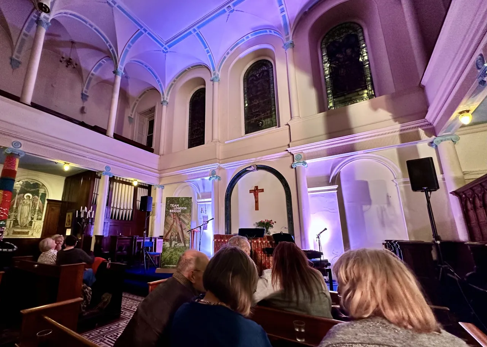

What a lovely event! Barb's singing was rich and exciting, with Jenny's delightful and expressive piano accompaniment was all the more impressive when we learned it was almost entirely improvised.

Unlike the many excellent but inexperienced musicians out there, Barb also showed us her sparkling wit and comic timing in the spaces between her songs; I felt at home in her space. It was lovely.

And a beautiful space for it too!

