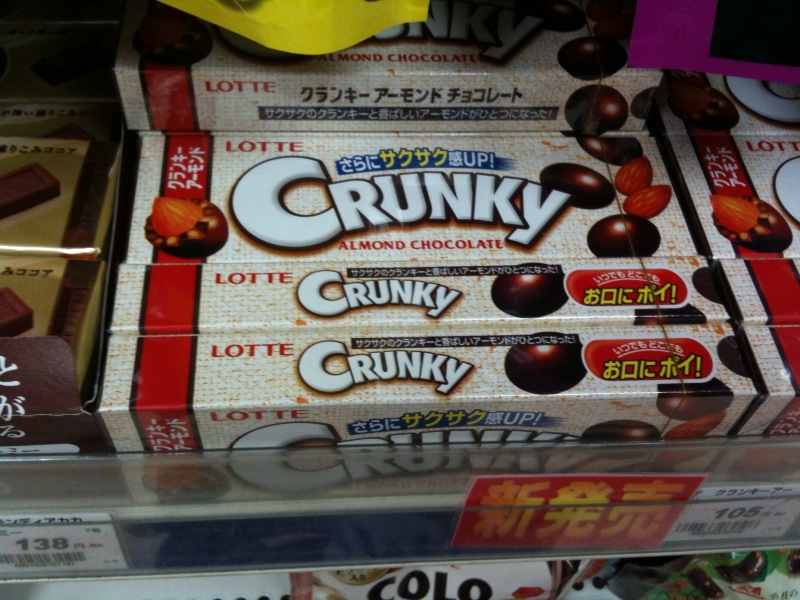
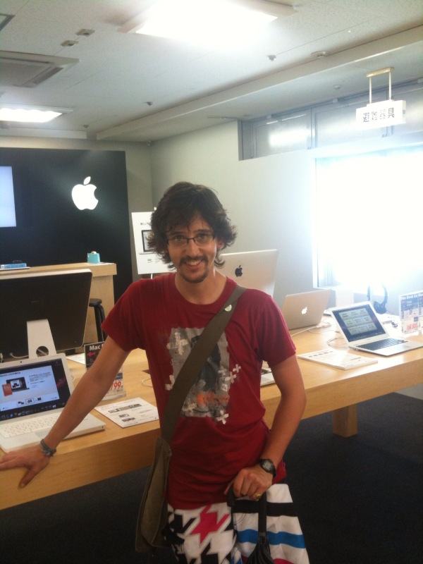
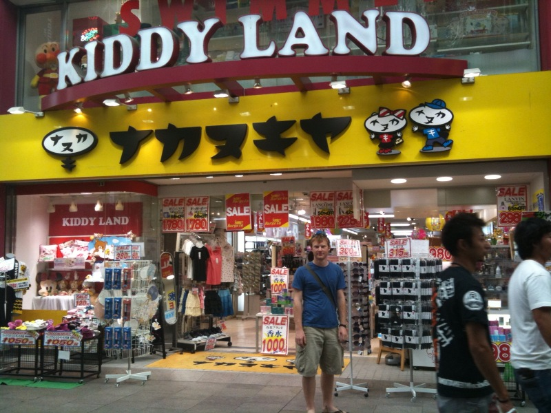
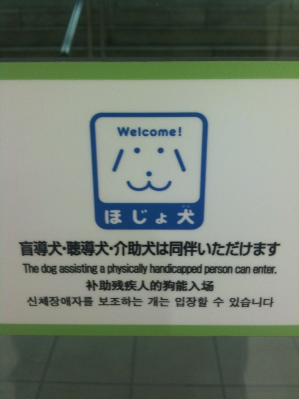

Some silly photos from the past couple of days - the 'Crunky' biscuity thing they have here sounds kinda crap and kinda funky, is that a good thing?; me in an Apple dept. in Hiroshima (yaaaay); JK in 'Kiddy Land'... Don't ask; and finally the logo for 'Guide dogsallowed' in Kyoto airport, answers as to what the sogn really means on the back of a postcard to 「JP,#2, GL7 2DX」winner gets a Japanese present :P

