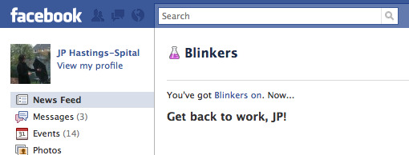

I built [Blinkers](https://github.com/jphastings/blinkers), a little greasemonkey script/Firefox extension that will prevent you from seeing your own Facebook news feed. Why? Because we all know it _eats time_ and poops procrastination guilt.

If you're still having difficulty avoiding the internets while you work, consider using my [DialUp](https://vimeo.com/9632924) application (or help me make it better!)
