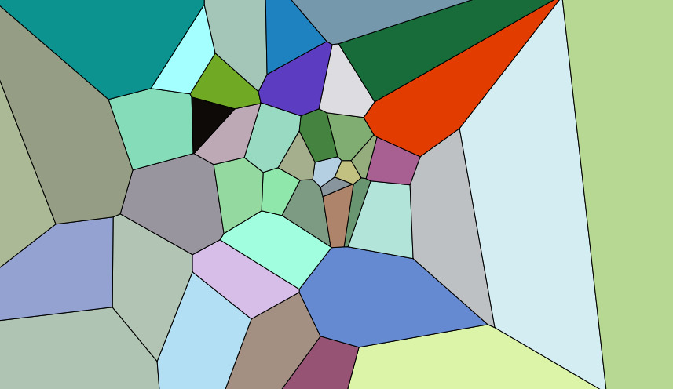

I finally got round to [completing project prime](/standalone/project-prime/), it's a collaborative artwork based on four of [my poems](https://www.byJP.me/poetry), Chapters [I](https://www.byJP.me/poetry/chapter-i), [II](https://www.byJP.me/poetry/chapter-ii), [III](https://www.byJP.me/poetry/chapter-iii) and [IV](https://www.byJP.me/poetry/chapter-iv).

Though these are, perhaps, uninspiring names they were chosen to allow readers (in particular the collaborative artists involved with this work) to form their own interpretations and impressions of the poetry. Over the course of several weeks 44 people submitted a little information about themselves and their impressions of each of the pieces.

Each person is represented in the artwork below by a coloured shape. Each shape's centre is placed on the canvas according to their age, with older people towards the right, and the first people to collaborate nearer the bottom. The colour of the shape shows their preference towards each poem the stronger the primary colour the more they liked that poem; red for Chapter II, green for Chapter III and blue for Chapter IV. Chapter I has is preference shown by transparency, the faster a shape pulses the more it was liked by the person it represents.

If you're interested in the code I used to generate the work, you can see it [in a gist on github](https://gist.github.com/jphastings/362995) — I hope you enjoy it!
