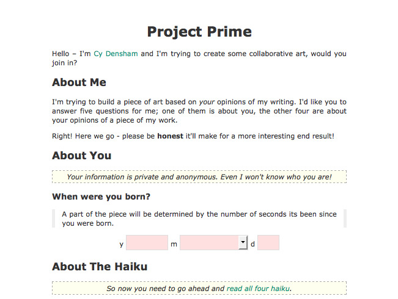

In its final days now, [Project Prime](/standalone/project-prime)[^1] is my attempt at combining art, poetry and maths in a funky little collaborative weave.

Hopefully, the result will be a collection of people's opinions of my poetry in a dynamic visual form… I'm still to be convinced that it'll work well though! I'll probably end the work this weekend, and work on producing the final piece… stay tuned.

[^1]: Import note: I've tried to keep the layout of the page exactly as it was, though I've had to remove the system that showed the comments people left, as I've lost the original data.
