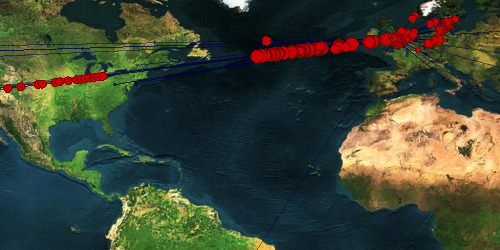

I improved Where On The Web? with an OpenGL twist (making it a lot faster - tho antialiasing is broken) and by varying the size of the ‘packets’ as they travel around the globe, you can now see roughly how much data is winging its way around the web.

The [gist containing the sketch](https://gist.github.com/jphastings/98878) has been updated to reflect these changes, have a play!
