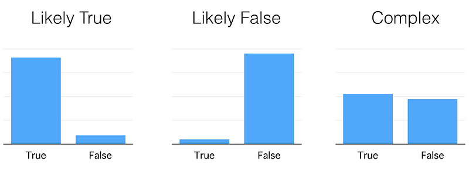
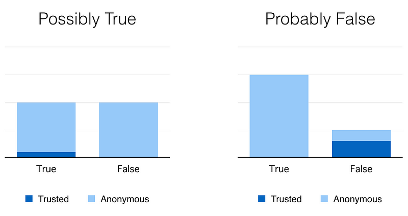
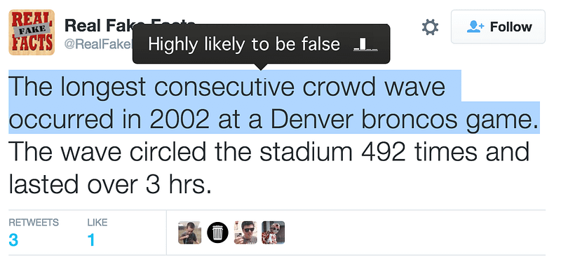

The internet can be seen as a mechanism for speeding up and broadening information transfer; Wikipedia shares [knowledge](https://en.wikipedia.org/wiki/User:Alan_Liefting/Essays/The_sum_of_all_human_knowledge), Newseum makes [local news global](https://web.archive.org/web/20160202062258/http://www.newseum.org/todaysfrontpages/), Reddit, Twitter, Imgur and countless more give anyone access to subcultures, viewpoints and opinions from all over our planet—I don’t need to highlight why we’re calling this this [Information Age](https://web.archive.org/web/20151004040741/http://www.sciencemuseum.org.uk/educators/plan_and_book_a_visit/things_to_do/galleries/information_age.aspx). All this is an extension of the human sharing processes that humans use in face-to-face communication, but I think there’s one facet which hasn’t quite made the jump to the internet yet.

In person, assessing the believability of what you hear is intuitive, you might know the person and trust their opinions, or they could be a stranger and you’d be wary of what they have to say. Online, most communication is functionally anonymous, either because the other party is masking their identity, or because you’ve never met them and have no context for their existence despite knowing their (user)name. This, as well as the sheer quantity of knowledge available, makes it almost impossibly hard to fact-check or otherwise judge a source of information for believability in the long distance communication the internet enables.

> “Rust is superior to Go as a systems-level software language.”
>
> “Genuine French antique ‘grandfather’ clocks strike the hour twice, two minutes apart from each other.”

The extent to which I believe these two phrases depends directly on _who_ I hear them from. From a fellow software engineer I’d believe the first phrase until I had reason to try these languages out myself and I’d call bullshit on the second phrase; from my antique dealer father I’d hear the second and assume it to be true without question, but chuckle at the first, ignore the opinion and remind him of the last time he tried to update a formula in an Excel spreadsheet.

The key here is, of course, context—specifically around the source of statements like these. Talking to an individual you know gives you contextual information on their areas of expertise as well as their demeanour and body language, something which the internet has to a great extent not been able to replicate.

Early mass-distribution of “statements of fact”, via entities like publishing houses, took a simple approach to this issue: create a reputation. This allowed people to make statements like “I trust this newspaper” or “you shouldn’t believe this author” based on previous interactions with that entity. This was aided by management staff that would give publishing brands a recognisable niche, like magazines, specialising in one corner of human endeavour.

The advent of [hyperlinking](https://en.wikipedia.org/wiki/Hyperlink) and the web allowed rapid movement between _vastly_ different topics and authors with deeply different levels of experience in their subject matter. I believe the hole in today’s internet — when it comes to inter-human communication — is that there is no well defined mechanism for quickly assessing the believability of the huge amount of information we each come across every day without referring to brand, something the individual has little control over.

---

So how would you build a framework for enhancing your ‘gut instinct’ for credence on the internet? Clearly the web already lets you research any topic in great depth if you need a deep understanding, but what about ‘at a glance’? And how would you allow for the often different and opposing views on whether something should be believed or not? A statement like “The Earth was formed 4,000 years ago” will be considered absolutely true in some circles and absolutely false in others.

Because I like thinking and creating, I’ve put together a prototype of a mechanism that allows this, I call it **Credence**.

Credence allows you to make assertions like this:

> [This website](/twitter/#/RealFakeFacts/status/409062831355486208) states that: “The longest consecutive crowd wave occurred in 2002 at a Denver broncos game. The wave circled the stadium 492 times and lasted over 3 hrs.”
>
> At this time, I believe this to be **false** and I cite [this website as proof](http://www.guinnessworldrecords.com/world-records/longest-mexican-wave-%28timed%29). Signed, JP

There are a number of components to these sentences. I shan’t go into the technical details of the (nascent) Credence protocol, suffice to say that these components are compiled into a single sharable nugget that I call a _Cred_ which is published and shared with as many other Credence users as possible, so that it is universally accessible. Those components are:

- **Statement**: The specific sentence that is being commented upon.
- **Source**: A website that gives context to the statement.
- **Assertion**: Whether the author believes the statement to be true, false, ambiguous or whether they wish to explicitly state “no comment”.
- **Proof**: Some corroboration for the assertion that is a good starting point for an explanation. It could be a blog post you write, or a reputed commentary on the topic.
- **Time**: When the assertion was made.
- **Signature**: A way for others to know who is making this claim, and thus what context they can apply to it.

A **statement** and **assertion** are clearly required; the need for a **source,** or context, becomes obvious for statements like “the government’s actions were justified” (Which government? Which country? What actions?); **proof** is helpful for recipients of the _Cred_ that wish to delve deeper into the topic and a **time** is crucial to understanding the assertion’s relevance, as any historian will confirm.

**Signatures**, effectively proof of identity, become very interesting on the internet. Being able to disagree with a viewpoint without fear of retribution is a valuable privilege, but a system of credence without identity provides nothing new. I chose to use a facet of [cryptographic signatures](https://en.wikipedia.org/wiki/Digital_signature) that means if a user chooses to share the public half of their cryptographic identity all of their _Creds_ can have their author recognised, but if they choose not to it is impossible to determine if two _Creds_ are even from the same author, allowing an element of selective anonymity.

---

So far I have explained how Credence allows users to proclaim their belief in specific statements, but the use in this comes from interpreting the _Creds_ that others have announced.

Because _Creds_ are designed to be small (the example above condenses to 493 bytes, small enough that even a slow broadband internet connection could transfer thousands a second) and they are shared prolifically (so missing some as they are sent to you is no problem), the Credence service on your computer will have an enormous wealth of assertions stored on it at any given time. It can also request _Creds_ relevant to the topics you’re interested in from it’s neighbours. With this information it analyses the all relevant _Creds_, counts how many people believe each statement is true, false and so on, _weights these numbers_ based on your trust in the authors (if known) and can produce an indication of what your first thoughts on this topic would be if you polled the people you trust.

This aggregated information could be condensed into specific phrases similar to “Likely true”, “Probably false” or“Complex”; it could be worked into a graphic or an alert if a boundary condition is met. There are many interesting ways to cut this data (and the beauty of having that data is that the user can choose how to interpret it).

If we ignore _how much_ you trust each author for a moment, you could use the count of the number of people who believe a statement to be true and false to organise statements into textual categories based on their shape, like this:

Initially this seems to be a great fit for our problem, but a malicious Credence user could flood a specific statement with assertions in one particular direction to sway opinion, so significantly more weight is given to trusted authors, to the point where anonymous users are essentially ignored, and even if there is an overwhelming anonymous majority the indication given is speculative:

A good fit would be showing the user an indication of the data and text which gives a quick indication of how much credence should be given to a statement, with links to allow investigation where appropriate. If you’ll forgive my terrible UX skills, the example _Cred_ above might be displayed like this:

A browser extension can interact with the Credence server and highlight statements on pages you’re viewing that you might want to take with a pinch of salt. I’m slightly scared by what some newspaper articles might look like.

---

A protocol like Credence can only hope be the infrastructure upon which more useful tools are built, but I hope I’ve managed to outline how a system like this might work and the benefits it could offer. I find the decentralised nature of the reputation users can generate using a system like this very interesting as it removes the chance for unquestioning acceptance of facts based on general reputation alone; eg. an incorrect Wikipedia article which is cited by a newspaper, which is in turn used as proof that the Wikipedia article is correct, like [this poor German minister](http://tech.slashdot.org/story/09/02/10/2211220/false-fact-on-wikipedia-proves-itself) whose name was misquoted.

Credence is just a prototype (and a brief experiment in writing in a new software language for me), but I believe this principle of distributed credence is an important one for the future of mass-communication and I’d be interested in hearing thoughts on, and references to research around, this and related topics.

You can see how my work on it progresses at [http://getcredence.net](http://getcredence.net).

---

_Some early questions about Credence centred around the fact that it would enable misguided people to propagate provably incorrect information as truth. I thought I’d address that here as it’s clearly something I should have included!_

One key principle in Credence’s design has been that it should not be opinionated; it will not try to tell you that something is incorrect unless the body of people you trust holds that view. This does allow groups of people to express widely disproved opinions as fact, just as is feasible in non-digital communities, but the important difference is that Credence will continue to check for counter-evidence.

In non-digital interaction if you accept a fringe opinion as truth, the only time you’re likely to reassess that opinion is if you have to act upon it with some level of risk. If the opinion carries little risk in belief, or is rarely tested by the believers then it can [continue unchecked for generations](http://www.informationisbeautiful.net/visualizations/common-mythconceptions/) — for example, [Einstein wasn’t bad at maths](http://www.todayifoundout.com/index.php/2011/12/albert-einstein-did-not-fail-at-mathematics-in-school/).

Credence however continues to check viewpoints as they shift, so if _one_ trusted user in a community proclaims that “Einstein was bad at maths” is _false_, it could detect this and prompt you saying “the believability of this statement has shifted recently, would you like to look at the newly stated evidence?”.

In this way a Credence-like system could become an agent for stimulating the revaluation of your own opinions as others’ shift, rather than just the adoption of the consensus. For this reason I think Credence has broad usefulness in academic communities, where theoretical outcomes are based on the believability of statements connecting things seen as axiomatic to high level and unexplored concepts.
